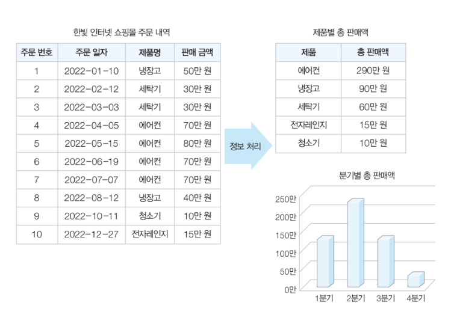
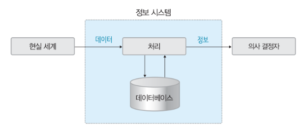
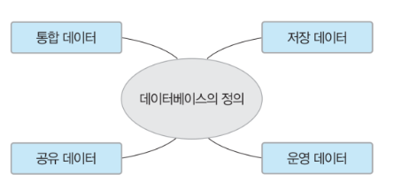
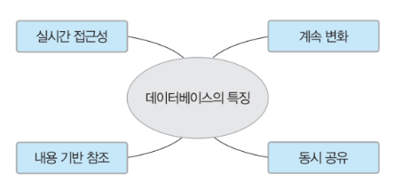
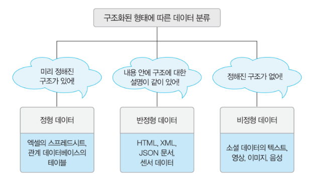
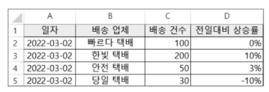
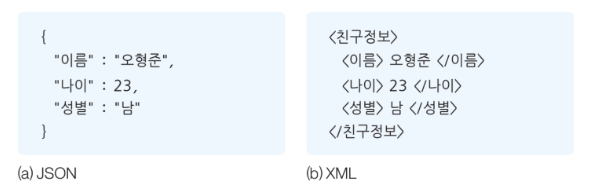
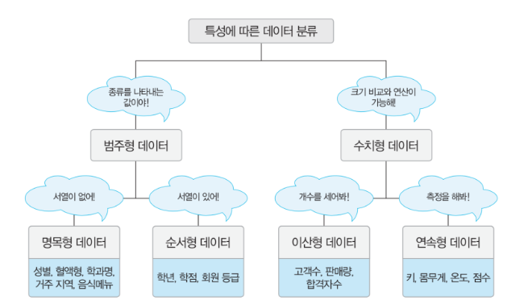

# 데이터베이스 기본 개념

## 1. 데이터베이스의 필요성

### 1. 데이터와 정보

- 데이터(=자료): 현실 세계에서 단순히 관찰하거나 측정하여 수집한 사실이나 값
- 정보: 데이터를 의사 결정에 유용하게 활용할 수 있도록 처리하여 체계적으로 조직한 결과물

#### 정보처리 (information processing)

- 정보처리: 데이터에서 정보를 추출하는 과정 또는 방법
  - 수집한 데이터를 효율적으로 저장했다가 필요할 때 사용할 수 있게 데이터베이스로 관리

### 2. 정보 시스템과 데이터베이스

- 정보 시스템(information system): 조직 운영에 필요한 데이터를 수집하여 저장해두었다가 의사 결정이 필요할 때 처리하여 유용한 정보를 만들어주는 수단
  
- 사용 목적에 따라 저장되는 데이터의 내용과 부르는 이름이 다름

## 2. 데이터베이스의 정의와 특징

### 1. 데이터베이스의 정의

- 데이터베이스(DB: Database): 특정 조직의 여러 사용자가 '공유'하여 사용할 수 있도록 '통합'해서 '저장'한 '운영'데이터의 집합
  

#### 공유 데이터 (shared data)

- 특정 조직의 여러 사용자가 함께 소유하고 이용할 수 있어야 하는 공용 데이터

#### 통합 데이터 (integrated data)

- 데이터 중복성(data redundancy)를 허용하지 않음
  - 효율성 때문에 의도적으로 중복 허용하기도 함
- 데이터의 중복을 최소화하고 통제가 가능한 중복만 허용한다는 의미

#### 저장 데이터 (stored data)

- 컴퓨터가 접근할 수 있는 매채에 저장해야 함

#### 운영 데이터 (operational data)

- 일시적으로 사용하고 마는 것이 아닌, 지속적으로 유지해야 하는 데이터

### 2. 데이터베이스의 특징

#### 실시간 접근 가능 (real-time accessibility)

- 사용자의 데이터 요구에 실시간으로 응답할 수 있어야 함

#### 계속 변화 (continuous evolution)

- 현실 세계의 상태를 정확히 반영해야 함
  - 현실 세계는 끊임없이 변하므로 데이터베이스의 데이터도 변화해야 한다
- 현재의 정확한 데이터 유지

#### 동시 공유 (concurrent sharing)

- 여러 사용자가 동시에 이용할 수 있는 동시 공유의 특징을 제공해야 함

#### 내용으로 참조 (content reference)

- 저장된 주소나 위치가 아닌 내용(content), 즉 값(value)으로 참조할 수 있다

## 3. 데이터 과학 시대의 데이터

- 데이터베이스의 주 목적은 데이터를 모아두는 것

### 1. 형태에 따른 데이터 분류

#### 정형 데이터 (structured data)

- 구조화된 데이터
- ex. 엑셀 스프레드시트, 관계 데이터베이스 테이블
  
- 미리 정해진 데이터 구조를 스키마(schema)라 함

#### 반정형 데이터 (semi-structured data)

- 구조에 따라 저장된 데이터지만 데이터 내용 안에 구조에 대한 설명이 함께 존재
- ex. HTML, XML, JSON, 웹 로그, 센서 데이터
  
- 스키마라고도 하지만 메타 데이터(metadata)라고도 함

#### 비정형 데이터 (unstructured data)

- 정해진 구조가 없이 저장된 데이터
- ex. 텍스트, 영상, 이미지, 음성, 워드, PDF

### 2. 특성에 따른 데이터 분류

#### 범주형 데이터 (categorical data)

- 범주로 구분할 수 있는 값
- 대부분 문자 타입으로 양적 측면에서 크기 비교, 산술 연산이 불가능함
  - 질적 데이터 (Qualitative Data) 라고도 함

##### 명목형 데이터 (nominal data)

- 순서, 서열이 없는 값

##### 순서형 데이터 (ordinal data)

- 순서, 서열이 있는 값

#### 수치형 데이터 (numerical data)

- 양적 측면에서 크기 비교, 산술 연산 가능한 숫자 값을 가진 데이터
  - 양적 데이터 (Quantitative data) 라고도 함

##### 이산형 데이터 (discrete data)

- 이어지지 않고 단절된 숫자 값을 가지는 데이터

##### 연속형 데이터 (continuous data)

- 연속적으로 이어진 숫자 값을 가지는 데이터

# 예상 면접 질문

1. 데이터베이스 특징 중 계속 변화하는 특징에 대해 설명
2. 반정형 데이터의 특징과 대표적인 예시 두 가지
