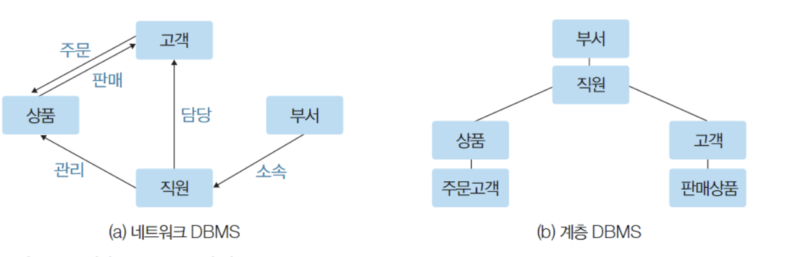
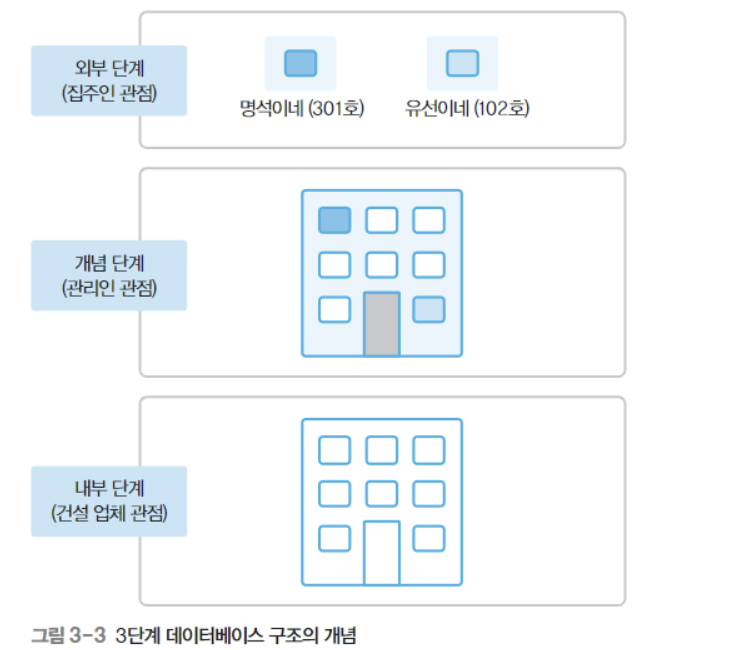
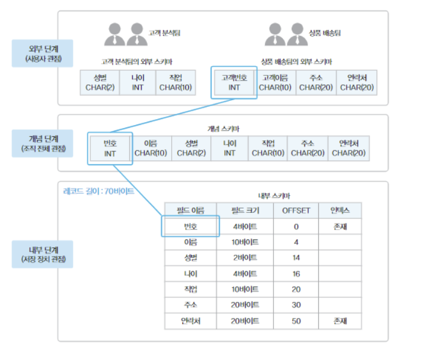

# CH2 데이터베이스 관리 시스템 

## 1. 데이터베이스 관리 시스템의 등장 배경 

### 파일시스템이 지닌 문제 

> Q. 파일 시스템이 무엇인지, 장단점을 말해보세요

- 파일시스템이라는 SW는 데이터를 파일로 관리할 수 있도록 생성,삭제,수정,검색하는 기능을 제공한다. 
- 파일의 논리적 구조, 물리적 구조를 정확하게 파악해야 연결된 응용 프로그램이 실행된다. 
- 파일시스템의 단점 
  1. 데이터 중복성 문제 : 같은 데이터가 여러 파일에 존재하게 된다.
     - 특정 파일에서만 데이터가 수정되면 데이터 불일치(통제가 되지 않는 수정을 포함) > 일관성 문제, 무결성(정확성) 문제가 발생함. 
  2. 응용 프로그램이 데이터 파일에 종속적 : 응용 프로그램이 파일에 직접 접근해야함. 따라서 파일의 구조가 바뀌면 응용 프로그램도 함께 변경해야한다 == 종속성 문제. 
  3. 데이터파일에 대한 동시공유, 보안, 회복 부족 : 응용 프로그램은 한번에 파일 한개에만 권한을 부여. 그러나 파일안의 레코드나 필드와 같은 작은 단위에 대한 통제 및 권한부여가 요구되기 때문에 문제 발생. 
  4. 응용 프로그램을 개발하기가 쉽지 않다. 

결론 : 데이터 중복성과 데이터 종속성을 해결하기 위해 데이터베이스를 사용한다. 

<br>

## 2. 데이터베이스 관리 시스템의 정의 


> Q. DBMS란 무엇인지 설명해라

- 데이터를 데이터베이스에 통합하여 저장하며, 공요 보안, 회복등의 복잡한 기능을 제공한다.
- 데이터 중복성과 종속성 문제를 해결할 수 있다. 


> Q. 데이터베이스 관리 시스템이 제공하는 주요 기능 3가지

- 정의 기능 : 데이터베이스 구조를 정의하거나 수정할 수 있다. 
- 조작 기능 : 데이터를 삽입, 삭제, 수정, 검색하는 연산을 할 수 있다. 
- 제어 기능 : 데이터를 항상 정확하고 안전하게 유지할 수 있다. 
  - 데이터가 연산 뒤에도 무결성을 유지해야한다. 
  - 장애가 발생해도 회복이 가능하도록 해야한다 
  - 권한이 있는 사용자에게만 데이터 접근을 허용하여 보안이 유지되도록 해야한다. 


<br>

## 3. 데이터베이스 관리 시스템의 장단점 


> Q. DBMS의 장점

1. 데이터 중복을 통제할 수 있다. 
   - 파일 시스템은 별도의 파일을 유지해야하여 데이터가 중복된다. 
   - DBMS는 데이터를 통합관리하므로 데이터 중복 문제를 해결할 수 있다. 
2. 데이터 독립성 확보
   - 파일 시스템은 파일 구조가 바뀌면 응용 프로그램도 함께 수정해야했다.
   - DBMS는 DB에 접근과 관리를 모두 관리하기 때문에 독립성이 확보된다
3. 데이터를 동시 공유할 수 있다. 
   - 데이터를 동시 접근할 수 있도록 지원한다. 
4. 데이터 보안이 향상된다.
   - 파일 시스템은 동일한 수준의 보안을 모든 파일에 적용하기 어렵다. 
   - 또한 사용권한이 파일단위이기 때문에 구체적이고 다양한 접근제어가 불가하다.
   - DBMS는 데이터에 관한 효율적인 제어가 가능하다. 
5. 데이터 무결성을 유지할 수 있다. 
   - 데이터 무결성은 저장된 데이터 값의 정확성을 의미한다. 
   - DBMS는 데이터 연산이 수행될 때마다 유효성을 검사하여 데이터 무결성을 유지할 수 있게 한다
6. 표준화할 수 있다. 
   - 데이터에 대한 모든 접근이 DBMS로 이루어지기 때문에 접근 방법, 형식과 구조등을 표준화하기 쉽다.
7. 장애 발생시 회복이 가능하다 
   - DBMS는 데이터 일관성과 무결성을 유지하면서 데이터를 장애가 발생하기 전 상태로 복구하는 회복 기능을 지닌다. 
8. 응용 프로그램 개발 비용이 줄어든다. 


> Q.DBMS의 단점

1. 비용이 많이 든다 
   - 파일 시스템은 운영체제와 함께 설치되므로 따로 구매비용이 들지 않는다
   - DBMS는 따로 설치해야 하므로 구매 비용이 많이 든다. 
   - 컴퓨터 자원을 많이 사용한다
2. 백업과 회복이 복잡하다 
   - 동시 공유를 지원하므로 장애가 발생했을 때 원인과 상태를 정확하게 파악하기 어렵다. 
3. 중앙 집중 관리로 인한 취약점 존재 


<br>

## 4. 데이터베이스 관리 시스템의 발전과정


> Q. 데이터베이스의 발전 과정에 따라 DBMS를 나눠보세요

- 1세대 : 네트워크 * 계층 DBMS
- 2세대 : 관계 DBMS
- 3세대 : 객체지향 * 객체관계 DBMS
- 4세대 : NoSQL, NewSQL DBMS


> Q. 1세대 DBMS인 네트워크 * 계층 DBMS에 대해 설명하세요


- 네트워크 DBMS는 데이터베이스를 노드와 간선을 이용한 그래프 형태로 구성하는 네트워크 데이터 모델을 사용한다.
   - 간선을 이용해 데이터간의 관계를 표현하기 때문에 구조가 복잡하고 변경하기 어렵다
   - EX :) IDS
- 계층 DBMS는 데이터베이스를 트리 형태로 구성하는 계층 데이터 모델을 사용한다. 
   - 구조가 단순하지만 부모자식이 명확한 트리 형태만으로 표현하기 힘들고 구조 변경이 어렵다 
   - EX :) IMS


> Q. 2세대 DBMS인 관계 DBMS에 대해 설명하세요

- 우리가 아는 그거 
- 테이블 형태로 구성하는 관계 데이터 모델을 사용한다. 
- 데이터베이스를 단순하고 이해하기 쉬운 구조로 구성한다는 장점이 있다. 
- EX :) Oracle, MSSQL, Access, MySQL, MariaDB...


> Q. 3세대 DBMS인 객체지향 * 객체관계 DBMS에 대해 설명하세요

- 객체지향 DBMS는 1980년대 후반에 등장하였다. OOP의 객체라는 개념을 이용해 객체지향 데이터 모델을 사용한다
  - EX :) O2, ONTOS, GemStone
- 객체관계 DBMS는 관계 데이터 모델에 객체 지향 개념을 도입한 것이다. 
  - EX :) Oracle


> Q. 4세대 DBMS인 NoSQL, NewSQL DBMS에 대해 설명하세요

- 비정형 데이터의 폭발적 생산, 빅데이터의 개념 등장으로 RDBMS만으로는 해결할 수 없는 문제가 발생하였음
- NoSQL은 데이터 구조를 미리 정해두지 않기 때문에 비정형 데이터를 저장하고 차리하는 환경에서 주로 사용된다. 
  - EX :) MongoDB, HBase, Cassandra, Redis, Neo-4j, OrientDB...
  - 그러나 RDBMS가 제공하는 안전성과 일관성을 아직도 중요하게 평가하고 있다. 
- NewSQL은 기존에 정형데이터-RDBMS, 비정형데이터-NoSQL로 나눠서 쓰던 불편함을 해결하기 위해 등장하였다 
  - 안정성과 일관성을 유지하면서도 SQL을 이용해 다양하고 복잡한 데이터 처리를 편리하게 요청할 수 있다. 
  - EX :) Spanner, VoltDB, NuoDB
- 


# CH3 데이터베이스 시스템 


## 1. 데이터베이스 시스템의 정의 

> Q. DB, DBMS, DB system 차이 

- DB : 데이터를 저장해둔 곳 
- DB system : DBMS를 이용해 조직에 필요한 정보를 제공해주는 전체 시스템
- DBMS : 데이터베이스에 저장된 데이터가 일관되고 무결한 상태를 유지하도록 관리하는 역할. 


<br>

## 2. 데이터베이스 구조


> Q. 스키마/인스턴스 는 무엇인가

- 데이터베이스에 저장되는 데이터 구조와 제약 조건을 정의한 것

```sql

CREATE TABLE Students (
    StudentID INT PRIMARY KEY,       -- 학번
    Name VARCHAR(50),                -- 이름
    BirthDate DATE,                  -- 생년월일
    Gender CHAR(1),                  -- 성별 ('M' or 'F')
    Major VARCHAR(50)                -- 전공
);

```

- 실제로 저장된 값이 인스턴스다. 
- 스키마는 한번 정의되면 자주 변경되지 않지만, 인스턴스는 계속 변하는 특성이 있다. 


> Q.3단계 데이터베이스 구조의 개념을 설명해라. 





- 외부단계 : 개별 사용자 관점에서 바라봄. 추상화(높)
- 개념단계 : 조직 전체의 관점에서 바라봄.
- 내부단계 : 물리적 저장장치 관점에서 바라봄. 추상화(낮)

> Q. 외부단계에 대해 설명해라

- 개별 사용자 관점에서 데이터베이스를 이해하고 표현한다. 
- 고객관리 담당자는 고객 데이터만 볼것이고 상품관리 담당자는 상품 데이터만 볼 것이다. 
- 외부단계에서 사용자에게 필요한 데이터베이스를 정의한 것을 외부 스키마라고 한다. 
- 따라서 외부 스키마가 여러개 존재할 수 있고 여러 사용자가 하나의 외부 스키마를 공유할 수 있다. 

> Q. 개념 단계에 대해 설명하라 

- 일반적으로 스키마 하면 개념 스키마를 의미한다. 
- 데이터베이스를 이용하는 사용자의 관점을 통합하여 데이터베이스를 조직 전체의 관점에서 이해하고 표현한다. 
- 전체DB에 관심을 두며 관리자의 관점에서 모든 사용자에게 필요한 데이터를 통합하여 전체 데이터베이스의 논리적 구조를 정의한다
- 데이터간의 관계, 제약조건, 보안정책, 접근권한에 대한 정의도 포함한다 


> Q. 내부 단계에 대해서 설명하라

- 데이터베이스를 디스크나 테이프 같은 저장장치의 관점에서 이해하고 표현한다. 
- 내부 스키마는 레코드의 구조, 구성하는 필드 크기, 인덱스를 이용한 레코드 접근 경로 등을 정의한다. 


> Q. 외부스키마(=서브스키마) / 개념스키마

- 외부스키마 : 외부단계에서 사용자에게 필요한 데이터베이스를 정의한 것. 여러개의 외부 스키마가 존재 가능하다. 
- 개념스키마 : 관리자 관점에서 모든 사용자에게 필요한 DB를 정의한 것. 하나의 데이터베이스에는 하나의 개념 스키마가 필요하다. 
- 내부스키마 : 전체 데이터베이스가 저장장치에 실제로 저장되는 방법을 정의한 것. 하나의 데이터베이스에는 하나의 내부 스키마가 필요하다. 

> Q. 스키마간의 연결성에 대해 설명해라

- 실제 데이터를 부르려면 사용자는 자신의 외부 스키마를 보고 내부 스키마에 따라 저장된 데이터베이스에 접근해야한다. 
- 결국 데이터 독립성을 실현하기 위해 스키마를 나누고 단계별로 스키마 사이의 대응관계를 정의한 것이다. 
- 외부 스키마와 개념 스키마 사이에 논리적 데이터 독립성이 존재하고
- 개념 스키마와 내부 스키마 사이에 물리적 데이터 독립성이 존재한다. 


> Q. 논리적 데이터 독립성에 대해 설명하라

- 개념 스키마가 변경되어도 외부 스키마가 영향을 받지 않는 것이다. 
- 전체DB의 논리구조가 변경되어도 외부/개념 사상정보만 적절히 수정하면 외부 스키마 변경이 필요없다
- 개념 스키마의 "연락처"가 "전화번호"로 바뀐다 해도 외부/개념 사상정보만 정확히 수정하면 된다. 


> Q. 물리적 데이터 독립성에 대해 설명하라

- 내부 스키마가 변경되어도 개념 스키마가 영향을 받지 않는 것이다. 
- 개념/내부 사상은 개념 스키마와 내부 스키마의 대응 관계를 정의한것으로 저장 인터페이스라고도 한다. 


> Q. 스키마와 사상정보에 대해 설명해라

- 저장된 정보를 올바르게 관리하고 이용하기 위해 부가 정보를 저장해야 한다 


<br>


## 3. 데이터베이스 사용자


> Q. 데이터베이스를 이용하는 사용자를 나눠보아라 

- 데이터베이스 관리자 / 응용프로그래머 / 최종 사용자 로 나눌 수 있다. 


<br>


## 4. 데이터 언어 

> Q. 데이터 언어의 종류 3가지를 말해라 

- DDL(데이터 정의어), DML(데이터 조작어), DCL(데이터 제어어)


> Q. DDL(데이터 정의어)에 대해 설명하라 

- 스키마를 정의, 수정, 삭제하기 위해 사용한다
- 데이터 정의어로 정의된 스키마는 데이터 사전에 저장되고 삭제, 수정도 이에 반영된다


> Q. DML(데이터 조작어)에 대해 설명하라 

- 데이터의 삽입, 삭제, 수정, 검색등의 처리를 요구하기 위해 사용한다
- 절차적 데이터 조작어 : 사용자가 어떤 데이터를 원하고 해당 데이터를 얻으려면 어떻게 해야되는지 구체적으로 설명한다. 
- 비절차적 데이터 조작어 : 사용자가 어떤 데이터를 원하는지만 설명한다.(선언적 언어)


> Q. DCL(데이터 제어어)에 대해 설명하라 

- 내부적으로 필요한 규칙이나 기법을 정의하기 위해 사용한다
- 다음과 같은 특성을 보장하기 위해서이다 
  - 무결성 : 데이터베이스에 정확하고 유효한 데이터만을 유지해야한다.
  - 보안 : 허가받지 않은 사용자가 데이터에 접근하는 것을 차단하거나, 허가된 사용자가 접근 권한이 있는 데이터에만 접근할 수 있게한다
  - 회복 : 장애가 발생해도 데이터의 일관성을 유지한다 
  - 동시성 : 여러 사용자가 같은 데이터에 동시에 접근하여 처리할 수 있게 한다. 


<br>


## 5. 데이터베이스 관리 시스템의 구성 


> Q. 질의 처리기 

- 사용자의 데이터 처리 요구를 해석하여 처리하는 역할을 담당한다. 
  - DDL 컴파일러 : 데이터 정의어로 작성된 스키마의 정의를 해석한다. 
    - 관리자의 도움을 받아 새로운 데이터베이스를 구축하고, 스키마의 정의를 데이터사전에 저장한다. 
  - DML 프리 컴파일러 : 응용 프로그램에 삽입된 데이터 조작어를 추출하여 DML컴파일러에 전달한다.
  - DML 컴파일러 : 데이터 처리요구를 분석하여 런타임 DB처리기에 해석하여 넘긴다. 
  - 런타임 데이터베이스 처리기 : DB에 접근하여 컴파일러로부터 받아온 데이터 처리를 실제로 수행한다. 
  - 트랜잭션 관리자 : 접근 권한이 유효한지를 검사하고 데이터베이스 무결성을 유지하기 위한 제약조건 위반 여부를 확인한다. 

> Q. 저장 데이터 관리자 

- 디스크에 저장된 데이터베이스와 데이터 사전을 관리하고 실제로 접근하는 역할. 

<br>


<br>
<br>


## 면접 예상질문 

> Q. NoSQL과 RDBMS의 특징과 차이를 말해보세요

- RDBMS는 2세대 DBMS로 일반적으로 정형 데이터를 처리하는 데 사용됩니다. 
- 일관성과 안전성을 유지하는 DBMS입니다.
- NoSQL은 4세대 DBMS로 정해진 데이터 구조가 없고 비정형 데이터를 처리하는데 사용됩니다. 
- NoSQL은 RDBMS를 완전히 대체할 수 없다는 의견이 많아 두개의 DB를 동시에 사용하는 경우가 많습니다. 


> Q. 데이터 언어의 종류 3가지를 말해보세요 


- 

> Q. 스키마에 대해 설명해보세요. 


