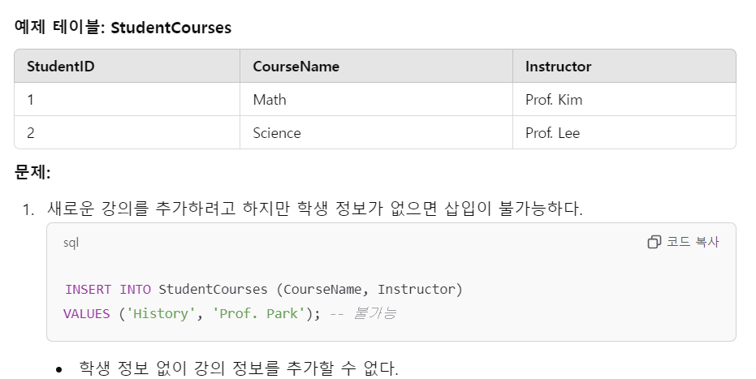
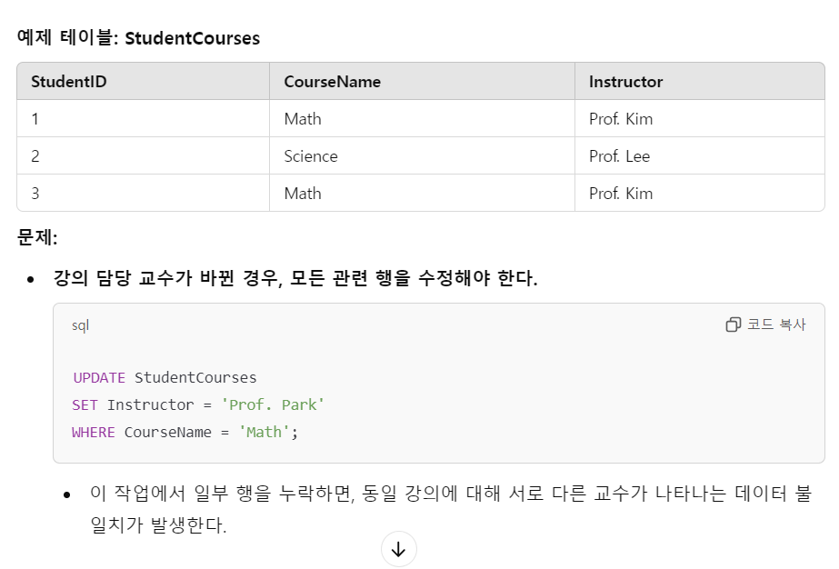
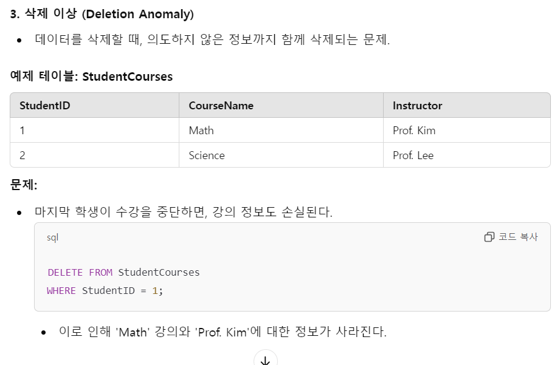
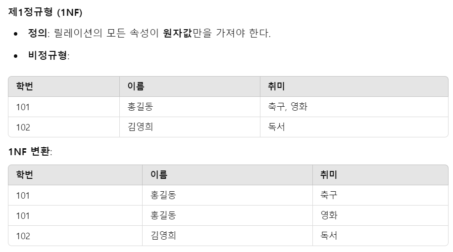
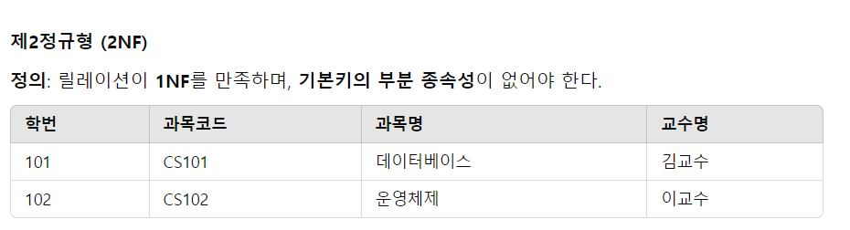
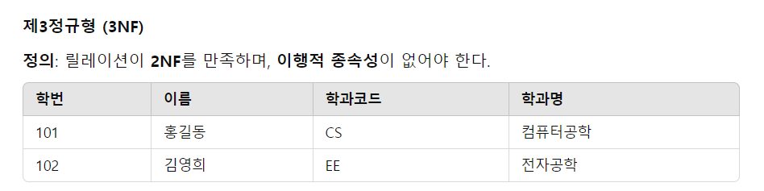
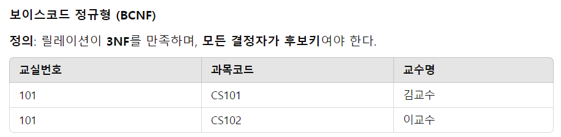

# CH8. 데이터베이스 설계 

## 1. 데이터베이스 설계 단계 

> Q. 데이터베이스 설계 과정을 말하세요

1. 요구사항 분석
   - 조직원의 DB 사용 용도를 파악한다. 
   - 실제 업무를 처리하는 사용자에게서 필요한 데이터 종류와 처리방법을 수집한다. 
2. 개념적 설계
   - 요구사항 분석 결과물인 명세서를 기반으로 개념적 데이터 모델을 이용해 표현한다. 
   - 주로 E-R다이어그램 모델을 많이 사용한다. 
3. 논리적 설계
   - 개발에 사용할 논리적 데이터 모델을 이용해 논리적 구조를 설계한다. 
   - 네트워크 데이터 모델, 계층 데이터 모델, 관계 데이터모델, 등이 있는데 일반적으로 관계 데이터 모델을 사용한다. 
4. 물리적 설계
   - 물리적구조를 설계 한다. EB를 저장장치에 실제로 저장하는 내부 저장구조와 접근 구조를 말한다. 
   - 실제 컴퓨터 시스템과 운영체제의 특성을 고려하여 설계하는 것이 특징이다. 
5. 구현
   - SQL로 작성한 명령문을 실행하여 데이터베이스를 실행한다. 
   - DDL을 사용한다

 

## 2. 요구사항 분석 

> Q. 요구사항 분석에서 고려해야 할 점은 무엇이 있을까요?

- 데이터베이스를 사용할 주요 사용자의 범위부터 결정해야 한다. 
- 범위를 결정 후 조직에서 수행하는 업무가 무엇인지 분석해야 한다. 

 

## 3. 개념적 설계

> Q. 개념적 구조를 설명해라

- E-R다이어그램과 같이 개념적 데이터 모델로 표현된 개념적 설계의 결과를 의미한다. 
- 개체를 추출하고 각 개체의 주요 속성과 키 속성을 선별하고 개체간의 관계를 결정해야 한다. 작업이 모두 완료되면 그 결과를 E-R 다이어그램으로 표현한다. 

 

> Q. 개체와 관계를 분류하는 방법은 어떻게 할 수 있을까

- 요구사항 분석의 명사를 찾아서 개체화 할 수 있다. 
- 물론 요구사항 명세에 없는 문장의 개체나 속성을 추가할 수 있다. 
- 요구사항 분석의 동사를 찾아서 관계를 결정할 수 있다. 
- 의미가 같은 동사가 여러개이면 대표 동사 하나만 선택한다. 
- 매핑 카디널리티 기준으로 추출 관계가 1:1, 1:n, n:m인지 분류하여야 한다. 

## 4. 논리적 설계

> Q. 릴레이션을  스키마로 변환할 때 적용할 수 있는 다섯가지 규칙을 말하라

1. 모든 개체는 릴레이션으로 변환한다. 
   - 개체의 이름을 릴레이션의 이름으로 하고 개체가 가진 속성도 릴레이션의 속성으로 그대로 변환한다. 
   - 개체가 갖고있는 키 속성은 기본키로 바꾼다 
2. 다대다 관계는 릴레이션으로 변환한다. 
   - 관계를 맺고 있는 개체들을 규칙 1에 따라 변환한 후 릴레이션들의 기본키 관계를 관계 릴레이션에 포함시키고 외래키를 지정한다. 
   - 고객과 상품 사이에 주문이라는 관계가 n:m으로 있다면 고객의 고객번호, 상품의 상품번호를 외래키로 사용하고 둘을 합쳐서 기본키로 쓰던가 주문번호를 만들어 기본키로 선언한다. 
3. 일대다 관계는 외래키로 표현한다. 
   - 일대다 관계는 릴레이션을 변환하지 않고 외래키로만 표현한다. 
   - 약한 개체가 참여하는 일대다 관계는 외래키를 포함해서 기본키로 지정한다 
4. 일대일 관계를 외래키로 표현한다.
   - 세개의 세부 규칙으로 나누어 적용한다 
   1. 일반적인 일대일 관계는 외래키를 서로 주고받는다
   2. 일대일 관계에 필수적으로 참여하는 개체의 릴레이션만 외래키를 받는다. 
   3. 모든 개체가 일대일 관계에 필수적으로 참여하면 릴레이션을 하나로 합친다. 
5. 다중 값 속성은 릴레이션으로 변환한다. 
   - 관계 데이터 모델의 릴레이션에서는 다중 값을 가지는 속성을 허용하지 않는다. 
   - 예를들어 사원의 부하직원은 여러명이 있다. 그래서 사원-부하직원 릴레이션을 만들어 해결할 수 있다. 

 

> Q. 추가적으로 고려할 사항이 있다면 무엇이 있을까? 

- 속성이 많은 관계는 관계 유형에 상관없이 릴레이션으로 변환하는 것을 고려할 수 있다. 
- 외래키만으로도 표현이 가능한 일대일, 일대다 관계는 릴레이션으로 변환하지 않는 것이 좋다. 
- 데이터 타입, 길이, 널값허용여부, 기본값, 제약조건을 걸어줄 수 있다. 

 

# CH9. 정규화 

## 1. 정규화의 개념과 이상 현상

> Q. 정규화란 무엇인가?

- 데이터베이스를 설계한 후 설계 결과물을 검증하기 위해 사용한다. 
- 이상현상이 발생하지 않도록 릴레이션을 분해하는 것이다. 

 

> Q. 데이터베이스의 이상현상 3가지를 말하라.

- 삽입 이상 : 새 데이터를 상빕하기 위해 불필요한 데이터도 함께 삽입해야 하는 문제 
- 갱신 이상 : 중복 튜플 중 일부만 변경하여 데이터가 불일치하게 되는 모순 문제
- 삭제 이상 : 튜플을 삭제 하면 꼭 필요한 데이터까지 함께 삭제되는 데이터 손실 문제

 

> Q. 삽입 이상의 예시를 설명하라

 

> Q. 갱신 이상의 예시를 설명하라

 

> Q. 삭제 이상의 예시를 설명하라

 

## 2. 함수 종속

> Q. 함수종속에 대해서 설명하세요

- 하나의 릴레이션을 구성하는 속성들의 부분집합을 X, Y라고 할 때, 어느 시점에서든 릴레이션 내의 모든 튜플에서 X값에 대한 Y값이 항상 하나면 `"X가 Y를 함수적으로 결정한다" or "Y가 X에 함수적으로 종속되어있다"` 라고 한다. 
- 보통 기본키나 후보키가 X가 되지만 Y의 속성값을 유일하게 결정할 수 있는 X는 뭐든 결정자가 될 수 있다. 

### 함수 종속 관계 예시

|학번 (StudentID)	| 이름 (Name)	|학과 (Department)|
|--|--|--|
|101	|Alice	|Computer Science|
|102	|Bob	|Mathematics|
|103|	Alice|	Physics|

1. StudentID → Name: 학번을 알면 학생 이름을 고유하게 알 수 있다.
2. StudentID → Department: 학번을 알면 학과를 고유하게 알 수 있다.

 

## 3. 기본 정규형과 정규화 과정

> Q. 정규화의 개념을 설명하세요

- 함수 종속성을 이용하여 릴레이션을 연관성이 있는 속성들로만 구성되도록 분해해서 이상현상이 발생하지 않는 올바른 릴레이션으로 만들어나가는 과정을 정규화라고 한다. 
- 목표는 관련이 없는 함수 종속성을 별개의 릴레이션으로 표현하는 것이다. 

 

> Q. 기본 정규형에 대해 설명하라

- 기본 정규형은 제1정규형, 제2정규형, 제3정규형, 보이스/코드 정규형이 있다.
- 일반적으로 기본 정규형에 속하도록 릴레이션을 정규화하는 경우가 대부분이다. 

 

> Q. 고급 정규형에 대해 설명하라

- 고급 정규형은 제4정규형, 제5정규형이 있다. 

 

> Q. 제1 정규형에 대해 설명하라

- 제 1정규형은 **릴레이션에 속한 모든 속성의 도메인이 원자값으로만 구성되어있으면 제 1정규형에 속한다**
- 릴레이션에 속한 모든 속성이 더는 분해되지 않는 원자값만 가져야한다. 
- 다중값을 가지는 속성은 제1정규형을 만족하지 못한다.
- 이상현상이 발생하는 릴레이션이 있을 수 있다. 
  - 삽입 이상 : 개체 무결성 제약 조건을 위반하여 속성이 null값이 될 수 있다. 
  - 갱신 이상 : 학번이 101인 홍길동이 개명하여 홍철수가 되었을 때 일부만 변경하면 데이터 일관성을 유지할 수 없다. 
  - 삭제 이상 : 이벤트 참여 릴레이션에서 고객아이디가 orange인 고객에 관련된 투플은 하나일 때 고객이 이벤트에 참여한 기록을 삭제해달라고 요구하면 투플을 삭제해야한다. 그런데 고객정보도 같이 사라질 수 있기 때문에 삭제 이상이 발생할 수 있다. 

 

> Q. 제2 정규형에 대해 설명하라

- 제 2정규형은 **릴레이션이 제1정규형에 속하고, 기본키가 아닌 모든 속성이 기본키에 완전함수종속되면 제2정규형에 속한다**
- 릴레이션을 분해하는 과정을 의미한다. 
- 부분함수 종속을 제거하는 것이 목적이다. 주의할 점은 분해된 릴레이션들을 자연 조인하여 분해 전의 릴레이션으로 다시 복원할 수 있어야 한다는 것이다. 
- 무손실 분해 : 정규화 과정에서 릴레이션의 분해, 정보의 손실이 일어나서는 안된다. 
- 이상현상이 발생할 수 있다. 
  - 부분함수를 제거해도 다른쪽에서 함수 종속성을 여러개 포함하고 있을 수 있기 때문에 이상현상의 위험성이 있다. 
 

### 학생 릴레이션
---
| 학번 | 
|-------| 
| 101 |
 | 102 |

### 과목 릴레이션
---
| 과목코드 | 과목명 | 교수명 | 
|----------|--------------|---------| 
| CS101 | 데이터베이스 | 김교수 | 
| CS102 | 운영체제 | 이교수 |

### 수강 릴레이션
---
| 학번 | 과목코드 | 
|-------|----------| 
| 101 | CS101 | 
| 102 | CS102 |

 

> Q. 제3 정규형에 대해 설명하라

- 제 3정규형은 **릴레이션이 제2정규형에 속하고, 기본키가 아닌 모든 속성이 기본키에 이행적 함수 종속이 되지 않으면 제3정규형에 속한다**
- 이행적 함수 종속 : 릴레이션을 구성하는 3개의 속성 집합 X, Y, Z에 대해 함수 종속 관계 X-> Y, Y -> Z 가 존재하면 논리적으로  X->Z가 성립한다. 이때 속성집합 Z가 X에 이행적으로 함수종속되었다고 한다. 

### 학생 릴레이션
---
| 학번 | 이름 | 학과코드 | 
|-------|--------|----------| 
| 101 | 홍길동 | CS | 
| 102 | 김영희 | EE |

### 학과 릴레이션
---
| 학과코드 | 학과명 | 
|----------|--------------| 
| CS | 컴퓨터공학 | 
| EE | 전자공학 |

 

> Q. 보이스/코드 정규형에 대해 설명하라

- 보이스/코드 정규형은 **릴레이션의 함수 종속 관계에서 모든 결정자가 후보키이면 보이스/코드 정규형에 속한다**
- 실제 데이터베이스에는 여러개의 후보키가 존재할 수 있다. 이 경우에는 제3 정규형까지 만족해도 이상현상이 발생할 수 있다. 
- 강한 제3정규형이라고도 한다. 보이스코드 정규형에 속하는 모든 릴레이션은 제3정규형에 속하지만 그 역은 아니기 때문이다. 
- 

BCNF 변환:

### 수업 릴레이션
---
| 교실번호 | 과목코드 |
|----------|----------| 
| 101 | CS101 | 
| 101 | CS102 |

### 교수 릴레이션
---
| 과목코드 | 교수명 | 
|----------|---------| 
| CS101 | 김교수 | 
| CS102 | 이교수 |

 

> Q. 제4정규형과 제 5정규형에 대해 설명하세요

- 고급 정규형으로 분류되는 제 4정규형은 릴레이션이 보이스/코드 정규형을 만족하면서 함수 종속이 아닌 다치 종속을 제거해야 만족할 수 있다. 
  - **다치 종속**이란 하나의 속성이 다른 속성집합에 종속되지만, 독립적으로 영향을 미치는 경우를 말한다. 
  - 한 속성이 다른 속성들과 독립적으로 결합될 수 있따면 이 관계를 분리하여야 한다. 
- 제5정규형은 제4정규형을 만족하면서 후보키를 통하지 않는 조인 종속을 제거해야 만족할 수 있다.
  - **조인종속**이란 릴레이션이 더 작은 릴레이션으로 분해된 후, 원래 릴레이션으로 정확히 복원되지 못하는 상태를 의미한다.  

 

## 예상면접질문

> Q. 수행했던 프로젝트에서 데이터베이스 설계 경험을 말해보세요. 데이터 베이스 설계를 하며 어려웠던 점이 있다면 말하고, 이를 기술적으로 어떻게 해결했는지 말해보세요. 

- 

> Q2. 제1정규형(1NF)과 제2정규형(2NF)의 차이를 설명하세요.

> Q: 다치 종속과 조인 종속은 항상 정규화를 통해 해결해야 하나요?

- 반드시 해결해야 하는 것은 아닙니다. 정규화의 목표는 데이터 무결성과 중복 제거이지만, 지나친 정규화는 성능에 영향을 줄 수 있습니다.
- 특히 실무에서는 정규화와 반정규화 사이에서 균형을 맞추는 것이 중요합니다. 쿼리 성능, 데이터 사용 빈도, 저장 비용을 고려해 정규화 수준을 결정합니다.
 
