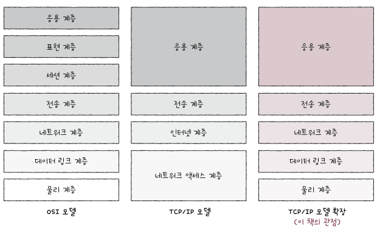

# CH1 컴퓨터 네트워크 시작하기 

## 1. 컴퓨터 네트워크를 알아야 하는 이유 

 

> 인터넷 

- 네트워크란 장치가 서로 연결되어 정보를 주고받을 수 있는 통신망을 의미한다. 
- 인터넷은 이런 네트워크를 연결한 '네트워크의 네트워크'를 뜻한다. 

 

## 2. 네트워크 거시적으로 살펴보기 

 

> 네트워크의 기본 구조 

- 네트워크는 노드, 간선, 노드간 주고받는 메시지로 구성된다. 
- 호스트 
  - 네트워크 노드중 가장자리에 위치하고 있다. 
  - 정보를 최초로 생성 및 송신하고 최종적으로 수신하는 역할을 한다. 
  - 서버 컴퓨터, 개인 데스크톱, 스마트폰 자동차, 냉장고 등이 될 수 있다. 
  - 서버 역할을 할 때는 '어떠한 서비스'를 제공하는 역할을 한다. 
  - 클라이언트 역할을 할 때는 서버에게 서비스를 요청하고 응답을 제공받는 역할을 한다. 
- 네트워크 장비 
  - 네트워크 노드 중 정보가 중간에 거치는 노드들이다. 중간노드라고도 한다. 
  - 이더넷 허브, 스위치, 라우터, 공유기 등이 있다. 
- 통신매체
  - 링크 역할을 하는 간선이 통신매체이다. 
  - 유선매체와 무선매체가 있다. 
- 메시지
  - 통신 매체로 연결된 노드가 주고받는 정보를 메시지라고 한다. 

 

> LAN과 WAN 

- LAN 
  - Local Area Network의 약자로 가까운 지역을 연결한 근거리 통신망을 위미한다. 
  - 가정, 기업, 학교처럼 한정된 공간에서의 네트워크를 LAN이라고 부른다. 
- WAN 
  - Wide Area Network의 약자로 먼 지역을 연결하는 광역 통신망을 의미한다. 
  - 인터넷은 WAN으로 분류되며 LAN을 연결하는 네트워크 이다. 

 

> 네트워크의 메세지 교환 방식 

- 회선 교환 방식 
  - 회선(circuit)을 설정하고 이를 통해 메세지를 주고받는 방식이다. 
  - 회선을 설정한다는 말은 두 호스트가 연결되었다는 말과 같다. 
  - 특징 : 두 호스트사이의 연결을 확보한 후 메세지를 주고받는다. 
    - 전송되는 양이 비교적 일정하다는 장점이 있다. 
  - 회선 스위치 : 호스트간의 회선을 적절하게 설정해줘야한다. 
    - 전화망을 예시로 들 수 있다. 
    - 그러나 회선의 이용 효율이 낮아진다. 

- 패킷 교환 방식 
  - 메시지늘 패킷(=소포)이라는 작은 단위로 쪼개어 전송한다. 패킷은 교환 네트워크 상에서 송수신되는 메시지 단위이다. 
  - 파일을 다운받는다고 하면 패킷 크기만큼 분할되어 전송된 후 컴퓨터에 도달하면 재조립된다. 
  - 패킷은 다양한 중간노드를 거칠 수 있다. 중간노드인 패킷 스위치는 패킷이 수신지까지 올바르게 도달할 수 있도록 최적의 경로를 결정하거나 패킷의 송수신지를 식별한다 
  - 패킷 스위치 네트워크 장비로 라우터와 스위치가 있다. 
  - 패킷의 내용 
    - 페이로드 : 패킷을 통해 전송하고자 하는 데이터 
    - 헤더 : 패킷에 대한 메타정보가 들어 있는 부분. 패킷의 길이, 번호, 네트워크 등의 정보를 포함
    - 트레일러 : 패킷의 끝을 나타내는 정보 

 

> 메시지 전송 방식 

- 유니 캐스트 : 1대1로 하나의 수신자에 메세지를 전송하는 방식. 
- 브로드 캐스트 : 자신을 제외한 네트워크 상의 모든 호스트에게 전송하는 방식. 
- 멀티캐스트 : 네트워크 내의 동일 그룹에 속한 호스트에게만 전송하는 방식.
- 애니캐스트 : 네트워크 내 동일그룹에 속한 호스트중에서 가장 가까운 호스트에게 전송하는 방식. 

 

## 3. 네트워크 미시적으로 살펴보기 

 

> 패킷 교환과정을 영수에게 택배보내는 과정으로 생각해보기 

1. 선물할 책(페이로드)을 택배 상자에 담는다 
   - 선물할 책의 언어를 영수가 이해할 수 있는 언어로 보내야 한다. 
2. 배송주소 등 택배기사가 읽을 메세지(헤더)를 작성하고 첨부한다
   - 메시지를 택배기사가 이해할 수 있는 언어로 작성해야한다. 
3. 택배기사(네트워크 장비)를 통해 발송한다. 

> 프로토콜

- 네트워크간 서로 이해할 수 있도록하는 의사소통 방식을 프로토콜이라고 한다. 
  - 노드간에 정보를 올바르게 주고받기 위해 합의된 규칙이나 방법을 의미한다. 

 

> 네트워크 참조모델 

- 통신이 일어나는 각 과정을 계층으로 나눈 구조를 네트워크 참조모델이라고 한다. 
- 계층을 나눈 이유는 다음과 같다 
  1. 네트워크 구성과 설계가 용이하다 
    -  각계층이 수행해야 할 역할이 정해져 있으므로 계층의 목적에 맞게 프로토콜과 네트워크 장비를 계층별로 구성할 수 있다. 
  2. 네트워크 문제 진단과 해결이 용이하다 
    - 통신과정에서 문제가 발생하더라도 문제의 원인을 계층별로 진단하기 수월하다. 
  - 
 

> OSI모델 

- 국제 표준화기구에서 만든 네트워크 참조 모델이다. 
- 물리-데이터링크-네트워크-전송-세션-표현-응용계층으로 나뉜다 

1. 물리 계층 
  - 비트 신호를 주고받는 계층이다. 
2. 데이터링크 계층
   - 네트워크 내 주변 장치 간의 정보를 올바르게 주고 받기 위한 계층이다.  
   - 이더넷과 LAN기술이 들어가있다. MAC주소라는 주소체계를 통해 네트워크 내 송수신지를 특정할 수 있다. 
3. 네트워크 계층
   - 메시지를 다른 네트워크에 속한 수신지까지 전달하는 계층이다. 
4. 전송 계층 
   - 신뢰성있고 안전성있는 전송을 해야할 때 필요한 계층이다.
   - 패킷의 흐름을 제어하거나 전송 오류를 점검해 신뢰성있고 안정적인 전송이 이루어지도록 한다. 
5. 세션 계층 
   - 세션을 관리하기 위해 존재하는 계층이다. 
   - 세션은 통신을 주고받는 호스트의 응용프로그램간 연결상태를 의미한다. 
6. 표현 계층
   - 번역기 
   - 압축, 암호화, 사람언어를 기계어로 코드 변환
7. 응용 계층
   - OSI참조모델 최상단에 있는 계층으로 사용자 및 응용프로그램과 가장 맞닿아있다. 

 

> TCP / IP 모델 

- 실용적 구현에 가까움 
- IP는 인터넷 프로토콜의 약자이다. 

> TCP/IP 4계층

1. 네트워크 액세스 계층
   - 링크 계층 / 네트워크 인터페이스 계층이라고도 부른다
   - 주로 데이터 링크 계층의 역할을 수행하는 쪽에 가까웠다. 

2. 인터넷 계층 
   - OSI모델에서의 네트워크 계층과 유사하다. 

3. 전송 계층 
   - OSI모델에서의 전송계층과 유사하다 

4. 응용 계층
   - OSI모델에서의 세션 계층, 표현 계층, 응용 계층과 유사하다. 

- 전기신호를 받는 근원적인 물리계층 ~ 사용자 프로그램과 가장 맞닿아있는 응용 계층 까지 연결이 된다. 

 

> 캡슐화 

- 송수신하는 메세지는 송신지 입장에서는 가장 높은 계층에서부터 낮은계층으로 이동하고, 수신자 입장에서는 가장 낮은 계층에서부터 가장 높은 계층으로 이동한다. 
- 한단계 아래 계층은 바로 위의 계층으로부터 받은 ㅐㅍ킷에 헤더와 트레일러를 추가해 나간다. 
- 이과정을 캡슐화 = encapsulation이라고 한다. 

 

> PDU 

- 각 계층에서 송신되는 메세지의 단위를 의미한다. 
- 데이터 : 응용계층, 표현계층, 세션계층
- 세그먼트, 데이터그램 : 전송계층 (TCP일 떄 세그먼트 / UDP일때 데이터그램)
- 패킷 : 네트워크 계층
- 프레임 : 데이터링크 계층
- 비트 : 물리 계층 

 

> 트래픽 

- 네트워크 내의 정보량을 의미한다 

> 과부하 

- 특정 노드에 특정시간동안 처리해야 할 정보가 많을 때를 의미한다. 

> 처리율 

- 단위 시간당 네트워크를 통해 실제로 전송되는 양을 의미한다. 
- bps(bits per second), Mbps(megabits per second), Gbps(Gbit/s, gigabits per second), pps(p/s, packets per second)

> 대역폭 

- 단위시간동안 통신매체를 통해 송수신할 수 있는 최대 정보량 

> 패킷손실 

- 패킷이 손실된 상황을 의미한다 
- 손실은 터미널에서 ping명령어로 확인할 수 있다. 몇 개의 패킷을 보내고, 받았는지, 몇%의 패킷이 손실되었는지를 알 수 있다. 