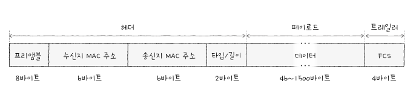

# CH2 물리 계층과 데이터링크 계층 

## 2-1 이더넷

### 이더넷 표준 

- 데이터링크 계층에서 주고받는 프레임은 이더넷 프레임의 형식을 따른다. 

### 통신 매체 표기 형태 

- 통신매체 표기를 이렇게 해봤다 : 10GBASE-T 
  - 뒤에 문자나 숫자가 붙는 형태이다. 
  - 전송 속도 : 10Gbps 속도를 지원하는 케이블이다. 
  - BASE : 베이스밴드의 약자로 변조 타입을 의미한다. 변조타입이란 비트 신호로 변환된 데이터를 통신 매체로 전송하는 방법을 의미한다. 
  - 추가특성 : 전송가능한 최대 거리를 명시한다. 혹은 물리계층의 인코딩 방식, 비트 신호를 옮길수 있는 전송로 수인 레인 수가 있다. 


### 이더넷 프레임 

- 이더넷 프레임 : 이더넷 네트워크에서 주고받는 프레임 **형식** 
  - 상위계층에서 받아들인 정보에 헤더와 트레일러를 추가하는 캡슐화와 제거하는 역캡슐화 과정을 거치며 만들어진다. 



1. 프리앰블 (Preamble)
   - 이더넷 프레임의 시작을 알리는 8바이트 크기의 정보이다. 
   - 첫 7바이트는 10101010을 가지고 마지막 바이트는 101010111을 가진다. 
   - 송수신지 간의 동기화를 위해 사용되는 정보이다. 

2. 수신지 MAC주소와 송신지 MAC주소 
   - MAC은 물리적 주소로 불린다. 
   - 네트워크 인터페이스마다 부여되는 6바이트(48비트) 길이의 주소이며 LAN내의 수신지와 송신지를 특정할 수 있다. 
   - 주소 변경이 가능한 경우도 많고 고유하지 않을 수 있다. 다만 동일한 네트워크 내에서 동작하는 기기간의 MAC주소가 우연히 같을 확률은 낮다. 

```bash
getmac /v
ipconfig /all
```
로 확인 가능하다. 

3. 타입/길이 
  - 필드에 타입 혹은 길이가 온다. 
  - 필드에 명시된 크기가 1500이하일 경우는 프레임의 크기를 나타내는데 사용되고, 1536이상일 경우는 타입을 나타내는 데 사용된다. 
  - 타입은 이더넷 프레임이 어떤 정보를 캡슐화했는지 나타낸다. 
    - IPv4 프로토콜이 캡슐화된 정보를 운반한다면 타입에는 16진수 0800이 온다. 

4. 데이터 
  - 상위 계층에서 잔달받거나 상위 계층으로 전달할 내용
  - PDU가 여기에 해당된다. 
  - 최대크기는 1500바이트이고 반드시 46바이트 이상이어야 한다. 그 이하의 데이터는 padding으로 채워진다. 

5. FCS
   - 수신한 이더넷 프레임에 오류가 있는지 확인하기 위한 필드이다. 
   - 데이터링크 계층에서 오류검출은 여기서 한다. 
   - CRC : 순환 중복 검사. 송신자는 프리앰블을 제외한 나머지 필드값을 바탕으로 CRC값을 계산하고 이 값을 FCS에 명시한다. 수신자는 나중에 데이터를 받아서 CRC값을 계산하고 FCS와 비교한다. 값이 같지 않으면 프레임에 오류가 있다고 판단한다. 


## 2-2 NIC와 케이블 

- 물리 계층과 데이터 링크 계층에서의 통신매체와 관련된 장비들 

### NIC

- 호스트와 통신 매체를 연결하고 변환을 담당한다. 
- NIC는 네트워크 인터페이스 카드, 네트워크 어댑터, LAN카드, 이더넷 카드 등의 명칭으로 불린다. 
- 통신매체의 신호를 호스트가 이해하는 프레임으로 변환하거나, 호스트가 이해하는 프레임을 통신매체가 보내는 신호로 변환한다. 
- 호스트와 네트워크간의 연결점을 만듬. 

### 트위스티드 페어 케이블 

- 구리선으로 전기 신호를 주고받는 통신 매체
- 트위스티드 페어 케이블은 구리선으로 이루어졌기에 전자적 간섭이 생길 수 있으며 전기 신호를 왜곡할 수 있다. 따라서 주변을 감싸는 차폐방식을 통해 이를 방지한다. 

### 광섬유 케이블 

- 빛을 이용해 정볼르 주고 받는다 
- 속도가 빠르고 먼 거리까지 전송이 가능하여 대륙간 네트워크 연결에 사용된다. 
- 광섬유 중심에는 **코어**가 있다. 코어를 둘러싸는 **클래딩**은 빛이 코어 안에서만 흐르도록 빛을 가두는 역할을 한다. 
- 지름이 8~10µm정도 되면면 싱글모드 광섬유, 지름이 50~60µm 멀티모드 광섬유이다. 코어의 지름이 작으면 광신호가 하나 이상 가기 어렵다. 따라서 싱글모드 케이블은 장거리 전송에 적합하지만 비용이 비싸다는 단점이 있다. 


## 2-3 허브 

- 물리 계층에 존재하는 네트워크 장비이다
- 물리 계층에는 주소 개념이 없다. 송수신지를 특정할 수 있는 주소는 데이터 링크 계층부터 존재한다. 
- 허브는 여러대의 호스트를 연결하는 장치이다. 
- 허브에는 4개의 포트가 있다. 

### 허브의 특징 

1. 전달받은 신호를 다른 모든 포트로 그대로 다시 보낸다. 
2. 반이중 모드로 통신한다. 
   - 반이중 모드는 1차선 도로처럼 송수신을 번갈아가면서 통신하는 방식이다. 
   - A에서 B로 메세지를 송신할 때 B는 A에게 송신할 수 없다. 
   - 반대는 전이중 방식이다. 

### 콜리전 도메인 

- 여러 호스트가 동시에 한개의 허브로 신호를 송신하면 충돌이 발생한다. 
- 이렇게 충돌이 발생할 수 있는 영역을 콜리전 도메인이라고 한다. 

### CSMA/CD 

- 허브가 반이중모드로 통신하기 때문에 허브에서 충돌이 발생한다. 
- 이런 충돌을 해결하기 위한 프로토콜이 CSMA/CD이다 
- CS : 캐리어 감지. 현재 통신 매체의 사용 가능 여부를 검사하는 것이다. 
- MA : 다중 접근. 두개 이상의 호스트가 부득이하게 동시에 네트워크를 사용하려 할 때를 의미한다. 
- CD : 충돌 검출. 충돌을 감지하면 전송이 중단되고 잼 신호라는 신호를 보내어 임의 시간동안 기다린 뒤에 다시 전송한다. 

## 2-4 스위치 

- 데이터 링크 계층에 존재하는 네트워크 장비이다. 
- CSMA/CD를 통해 해결하는 충돌문제를 좀더 근본적인 방법으로 해결할 수 있도록 도와준다. 


### 스위치 

- L2 스위치 : 2계층에서 사용한다는 의미이다. 
- MAC주소 학습 : 특정 포트와 해당 포트에 연결된 호스트의 MAC주소와의 관계를 기억한다. 


### MAC주소 학습 
- MAC주소 테이블이 채워지고 유지되는 방식이다. 

- 플러딩
  - 스위치는 마치 허브처럼 송신지 포트를 제외한 모든 포트로 프레임을 전송한다. 
  - 이런 스위치의 동작을 플러딩이라고 한다. 
  - 자기랑 관련없는 프레임을 받은 호스트들은 정보를 폐기한다. 
- 포워딩과 필터링 
  - 플러딩을 통해 시작 MAC주소와 받는 MAC주소를 알게 되면 다른 포트로 프레임을 내보낼 필요가 없다. 
- 에이징
  - MAC주소 테이블에 등록된 특정 포트에서 일정 시간 동안 프레임을 전송받지 못했다면 해당 항목은 삭제된다. 

### 브릿지 
- 스위치와 유사한 장비이다. 
- 브릿지는 네트워크 영역을 구획하여 콜리전 도메인을 나누거나 네트워크를 확장하는 용도로 사용된다. 

### VLAN

- 한대의 스위치로 가상의 LAN을 만드는 방버이다. 
- 허브는 송신지 포트를 제외한 모든 포트로 신호를 보내기 때문에 네트워크 상에 불필요한 트래픽이 늘어나고 성능저하로 이어진다. 
- 스위치도 불필요하게 연결된 호스트가 있을 수 있다. 

### VLAN 방식 

1. 포트기반 VLAN
   - 스위치의 포트가 VLAN을 결정하는 방식 
   - 특정 포트에 VLAN을 할당하고 해당 포트에 호스트를 연결하여 VLAN에 포함시킨다. 
2. MAC기반 VLAN
   - 포트가 VLAN을 결정하는 것이 아니라 송수신하는 프레임 속 MAC주소가 호스트가 속할 VLAN을 결정하는 방식이다. 