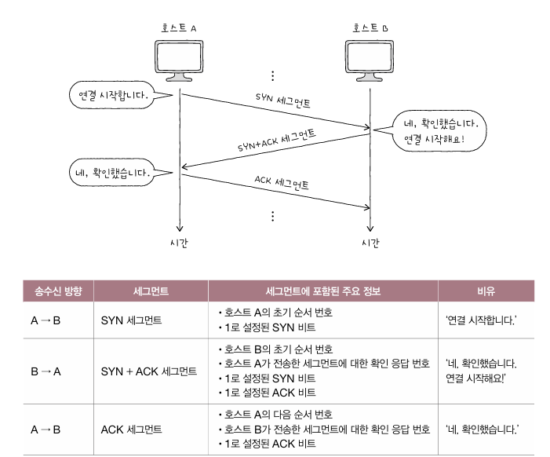
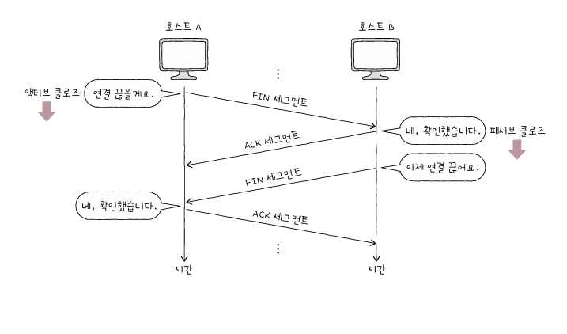

# CH4 전송계층 

## 4-1 전송계층 개요 : IP의 한계와 포트 

- 네트워크 IP는 신뢰할 수 없는 통신과 비연결형 통신을 수행한다 (한계점)
- 전송계층은 신뢰할 수 있는 통신과 연결형 통신을 가능하게 한다. 
- 따라서 IP의 한계를 극복하고 응용 계층의 애플리케이션 프로세스들을 식별하는 역할을 한다. 

### 신뢰할 수 없는 통신과 비연결형 통신 

- IP는 IP단편화와 IP주소지정을 한다. 또한 신뢰할수 없는 프로토콜이자 비연결형 프로토콜이라는 단단점이 있다. 
- 신뢰할 수 없는 통신 : IP프로토콜이 패킷이 수신지까지 제대로 전송되었다는 보장을 하지 않는 특징을 일컫는다. 패킷의 손상, 중복전송, 재전송도안하고 순서보장도 안되는 것. 
- 비연결형 통신 : 송수신 호스트간에 사전연결 수립작업을 거치지 않는 특징. 
- 이렇게 하는 이유는 성능때문이다. 모든 패킷을 다 확인하면 더 많은 시간과 대역폭, 부하가 요구되기 때문이다. 

### 전송계층이 하는 일 

1. 연결형 통신을 가능하게 한다 
   - TCP가 있음
2. 신뢰성있는 통신을 가능하게 한다. 
   - TCP는 패킷이 수신지까지 올바른 순서대로 확실히 전달되는 것을 보장하기 위해 재전송을 통한 오류제어, 흐름제어, 혼잡제어등의 기능을 한다. 

 

- 비교적 높은 성능을 위해 신뢰할 수없는 통신, 비연결형 통신이 필요하면 UDP를 사용한다. UDP도 전송계층의 프로토콜 

### 포트 

- 응용계층과의 연결다리 역할을 하는 것이다. 
- 패킷은 네트워크를 통해 컴퓨터로 온 후 웹, 게임, 특정 애플리케이션 까지 가야한다. 
- 패킷이 실행중인 특정 애플리케이션까지 전달되려면 패킷에 특정 애플리케이션을 식별할 수 있는 정보가 포함되어있어야 한다. 
- 서버동작 프로그램은 일반적으로 잘알려진 포트와 등록된 포트(0번~49151번)로 동작한다.

### NAT

- IP주소를 변환하는 기술이며 주로 네트워크 내부에서 사용되는 사설 IP주소와 네트워크 외부에서 사용되는 공인 IP주소를 변환하는데 사용된다
- NAT변환 테이블은 이런 변환을 위해 사용된다. 변환대상되는 IP주소는 1대1로 대응된다. 그러나 요즘에는 일대일 대응을 하기에 공인IP주소가 많이 필요해서 하지 않는다. 이 방식을 NAPT라고 한다 
- 포트기반의 NAT를 NAPT라고 한다. 같은 1.2.3.4라는 공인 IP주소로 변환되어도 포트번호가 6200인지 6201인지로 구분할 수 있게 되는 것이다. 이런 방식으로 내부의 IP주소와 외부에서 사용하는 IP주소를 N:1로 관리할 수 있다. 

### 포트 포워딩 

- 네트워크 내 특정 호스트에 IP주소와 포트 번호를 미리 할당하고 해당 IP주소:포트번호로써 해당 호스트에게 패킷을 전달하는 기능이다. 

## 4-2 TCP와 UDP

### TCP 통신 단계

먼저 3단계로 나눌 수 있다. 

1. 연결수립
2. 데이터 송수신
3. 연결종료

 

- TCP는 통신하기전에 연결을 수립하고 통신이 끝나면 연결을 종료한다. 
- MSS : Maximum segment Size의 약자로 TCP로 전송할 수 있는 최대 페이로드의 크기를 의미한다. TCP헤더의 크기는 제외하고 계산한다.

### 제어 비트

- TCP세그먼트 필드의 부가정보를 나타낸다. 
- 일반적으로 8비트로 구성된다. 
- ACK : 세그먼트의 승인을 나타내기 위한 비트
- SYN : 연결을 수립하기 위한 비트
- FIN : 연결을 종료하기 위한 비트 

### 순서번호와 확인응답번호 

- 순서 번호필드와 확인응답번호 필드는 TCP의 신뢰성을 보장하기 위해 사용되는 필드이다. 
- 순서 번호 필드에 명시된 순서번호는 세그먼트의 올바른 송수신 순서를 보장하기 위한 번호이다. SYN이 1로 설정되면 순서번호가 무작위로 설정된다. 만약 SYN이 100이면 젤 첫번째 세그먼트의 순서번호는 100이다. 그 다음 세그먼트들부터는 초기 순서번호 + 송신한 바이트 수 가 된다. 
- 확인 응답 번호는 다음으로 내가 받을 번호는 이것입니다~ 를 나타낸다. 일반적으로 수신한 순서 번호 + 1로 설정된다. 

### TCP연결 수립과 종료 

1. 연결 수립 : 3-way handshake
- A와 B가 3-Way Handshake를 한다고 가정한다. 

- 액티브 오픈 : 처음 연결을 시작하는 호스트의 연결 수립과정 
- 패시브 오픈 : 연결 요청을 받고 나서 요청에 따라 연결을 수립

2. 연결 종료 : 4-way handshake

- 액티브 클로즈 : 먼저 연결을 종료하려는 호스트에 의해 수행된다. (A)
- 패시브 클로즈 : 연결 종료 요청을 받아들이는 호스트에 의해 수행된다. (B)

### TCP상태 

1. 연결이 수립되지 않은 상태 

- Closed : 아무 연결이 없는 상태
- Listen : 연결 대기 상태. 액티브 호스트가 보낸 SYN세그먼트를 기다리는중중

2. 연결 수립과정에서 볼 수 있는 상태 

- SYN-SENT : 액티브 호스트가 상대로부터 SYN+ACK세그먼트를 기다리는 상태 
- SYN-RECEIVED : 패시브 호스트가 SYN+ACK세그먼트를 보내고 그 뒤의 ACK를 기다리는 상태
- ESTABLISHED : 연결이 확립되었음을 나타내는 상태태

3. 연결 종료 과정에서 주로 볼 수 있는 상태 

- FIN-WAIT-1 : 일반적인 TCP연결 종료 과정의 첫단계 FIN세그먼트를 보내면 액티브 호스트는 이상태가 된다.
- CLOSE-WAIT : 클로즈 호스트가 FIN세그먼트를 받고 ACK세그먼트를 보낸 후 대기하는 상태이다(~FIN을 보낼때까지)
- FIN-WAIT-2 : FIN-WAIT-1상태에서 ACK를 받았다면 FIN-WAIT-2가 된다. 상대의 FIN을 기다리는 상태이다. 
- LAST-ACK : CLOSE-WAIT상태의 클로즈 호스트가 FIN을 전송한다. 
- TIME-WAIT : 액티브 클로즈 호스트가 FIN세그먼트를 수신한뒤 ACK세그먼트를 전송한 뒤 접어드는 상태이다. 액티브 클로즈는  TIME-WAIT상태에 잠시 기다렸다가 CLOSED로 전이한다. 
  - TIMEWAIT상태가 필요 한 이유는 마지막 ACK세그먼트가 올바르게 전송되지 않았을 수 있기 때문이다. 세그먼트가 올바르게 전송되지 않았다면 세그먼트를 재전송해야한다. 만약 바로 연결을 종료해버리면 상대 호스트 입장에서는 마지막 ACK세그먼트를 받을 수 없다. 
- CLOSED

 

### UDP 데이터그램 구조 

- TCP와 달리 UDP는 비연결형 통신을 수행하는 신뢰할 수없는 프로토콜이다. 
- 기능이 적은 만큼 필드도 단순하다. 크게 송신지의 포트와 수신지 포트, 체크섬 필드, 길이등으로 되어있다. 
  - 송신지, 수신지 포트 : 포트번호가 담긴다 
  - 길이 : 헤더를 포함한 UDP데이터그램의 바이트가 담긴다 
  - 체크섬: 데이터그램 전송과정에서 오류가 발생했는지 검사하기 위한 필드이다. 수신지는 이 필드의 값을 토대로 데이터그램의 정보가 훼손되었는지를 판단하고, 문제가 있다고 판단한 데이터그램은 폐기한다. 

## 4-3 TCP의 오류/흐름/혼잡 제어 

- 데이터 송수신 중간과정에 발생하는 오류제어, 흐름제어, 혼잡제어를 살펴보자 

 

### 오류 제어 

- TCP는 잘못된 세그먼트를 재전송하는 방법을 사용한다. 
- TCP에는 오류 검출을 위한 체크섬필드가 있다고는 하지만 이것만으로 신뢰성을 보장하기는 힘들다. TCP가 신뢰성을 보장하려면 1. 송신한 세그먼트에 문제가 발생했음을 인지할 수 있어야 하고 2. 오류를 감지하게 되면 해당 세그먼트를 재전송 할 수 있어야 한다. TCP가 오류를 검출하고 세그먼트를 재전송하는 상황은 크게 두가지가 있다. 

1. 중복된 ACK세그먼트를 수신했을 때 
   - 송수신이 올바르게 이루어지는 과정에 호스트A가 보내는 n+1번 세그먼트가 중도에 손실이 되면 호스트 B가 A로 반복해서 전송을 하게 된다. 
2. 타임아웃이 발생했을 떄 
   - 재전송 타이머라는 값을 유지하는데 이게 끝나면 타임아웃이 된다. 만약 이시간안에 ACK세그먼트가 오지 않는다면 세그먼트를 재전송한다. 

 

#### ARQ : 재전송기법 
- ARQ는 자동 재전송 요구라고 한다. 3가지 방식이 있다. 

1. STOP-and-WAIT ARQ
- 제대로 전달했음을 확인하기 전까지는 새로운 메시지를 보내지 않는 방식이다. 
- 확인 응답을 받고 다시 메시지를 송신하는 것으로 높은 신뢰성을 보장한다. 그러나 네트워크 이용 효율이 낮아서 성능이 낮다. 
- 요즘 인터넷 환경에서는 잘사용하지 않는다.

2. GO-BACK-N ARQ
- ACK세그먼트가 도착하기 전이라도 여러 세그먼트를 보낼 수 있어야 한다. 
- 연속해서 메시지를 전송하는 파이프라이닝 기술을 사용한다. 
- 중간에 잘못 전송되면 그 세그먼트부터 다시 전송한다. n+2세그먼트가 손실되고 n+3이 도착했더라도 n+3세그먼트를 폐기한다는 말. 
- n번까지의 확인 응답(누적확인 응답)

3. Selective Repeat ARQ

- 선택적으로 재전송하는 방법이다. 
- 수신 호스트측에서 제대로 전송받은 각각의 패킷들에 대해서 ACK세그먼트를 보내는 것이다. 
- 개별확인 응답을 하는 방법이다

 

### 흐름 제어 

- 호스트가 받아서 처리할 수 있는 세그먼트의 양에는 한계가 있다. 
- 수신호스트가 한번에 n개의 바이트를 받아서 처리할 수 있다면 송신 호스트는 이점을 인지하여 n개바이트를 넘지않는 선에서 송신해야한다. 
- 수신 버퍼 : 수신된 세그먼트가 애플리케이션 프로세스에 의해 읽히기 전에 잠시로 저장되는 공간이다. 
- 버퍼 오버플로 : 저장 가능한 공간보다 더 많은 데이터를 저장하려고 할때 나타난다. 

### 흐름제어 - 슬라이딩 윈도우 

- 윈도우 : 송신 호스트가 파이프라이닝 할 수 있는 최대량을 의미한다. 
- 윈도우 크기만큼 확인응답을 받지 않고도 한번에 전송가능하다는 의미이다. 

 

### 혼잡 제어 

- 네트워크를 많은 사람들이 사용하면 트래픽으로 인해 패킷의 처리속도가 늦어지거나 유실될 수 있다. 
- 혼잡 윈도우 : 혼잡없이 전송할 수 있을 법한 데이터 양을 의미한다. 
  - 혼잡 윈도우가 작다면 네트워크가 혼잡한 상황이기에 한번에 전송할 수 있는 세그먼트 수가 적음을 의미한다. 

1. 느린시작
- 윈도우를 1부터 시작해 문제없이 수신된 ACK세그먼트 하나당 1씩 증가시키는 방향이다. 지수적으로 혼잡 윈도우를 증가시킬 수 있다. 
- 느린시작 임계치가 존재한다. 

2. 혼잡 회피 
- RTT마다 혼잡 윈도우를 1MSS씩 증가시키는 알고리즘이다. 
- 혼잡 윈도우를 선형적으로 증가시킨다. 
- 느린시작 임꼐치를 넘어선 지점부터 혼잡 발생이 있을 수 있으니 조심해서 증가시키는 방식이다 .
- 중간에 타임아웃이 발생하면 혼잡 윈도우 값은 1로 바뀐다. 

3. 빠른 회복 
- 세번의 중복 ACK세그먼트를 수신했을 때 느린 시작은 건너뛰고 혼잡 회피를 수행하는 알고리즘으로 이름처럼 빠르게 전송률을 회복하기 위한 알고리즘이다. 

Q1. TCP의 연결과 종료 과정(3-Way Handshake와 4-Way Handshake)을 간략히 설명하고, TIME_WAIT 상태가 필요한 이유를 말해보세요.

3-Way Handshake는 SYN, SYN-ACK, ACK를 통해 연결을 수립하고, 4-Way Handshake는 FIN, ACK로 연결을 종료합니다. TIME_WAIT 상태는 마지막 ACK가 손실될 경우 재전송을 위해 필요하며, 연결 안정성을 보장합니다.

Q2. 포트 포워딩과 NAT의 차이를 설명하고, 포트 기반 NAT(NAPT)의 장점을 말해보세요.

포트 포워딩은 특정 호스트와 포트를 미리 정해 패킷을 전달하며, NAT는 사설 IP와 공인 IP를 변환합니다. NAPT는 하나의 공인 IP를 여러 사설 IP에서 공유 가능하게 해 IP 자원을 효율적으로 사용합니다.